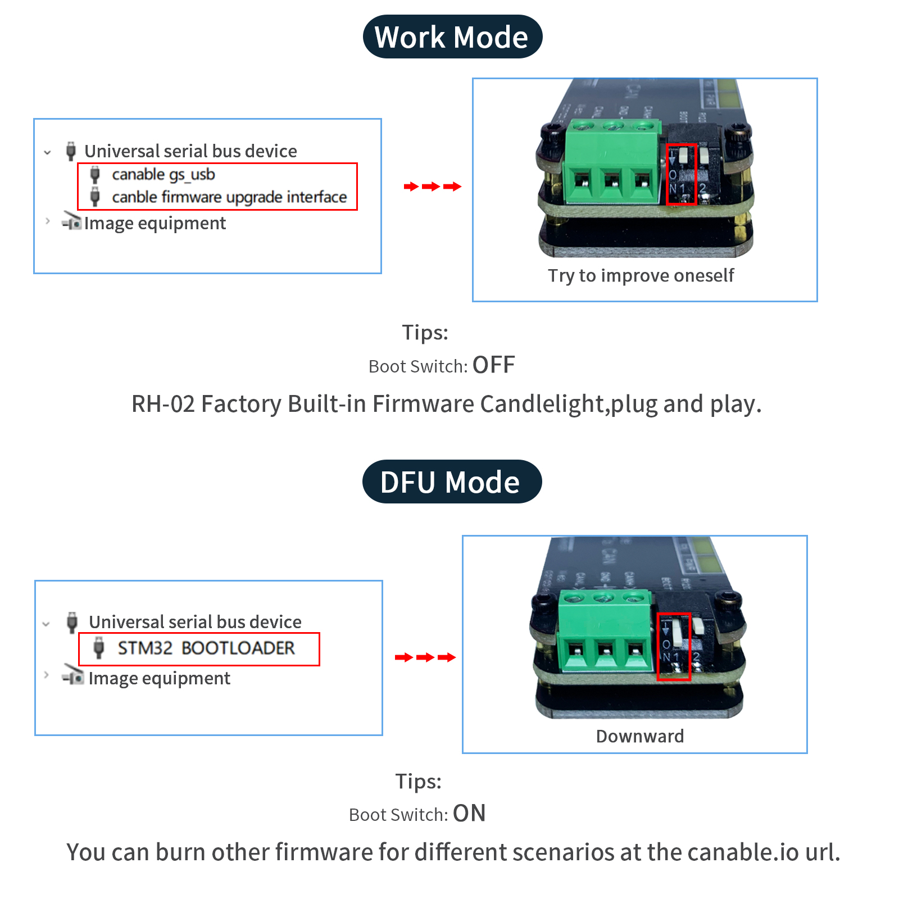
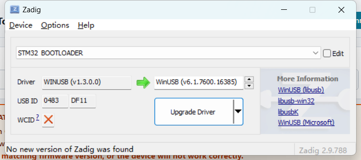
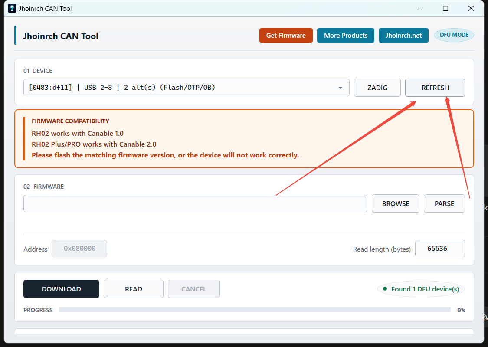
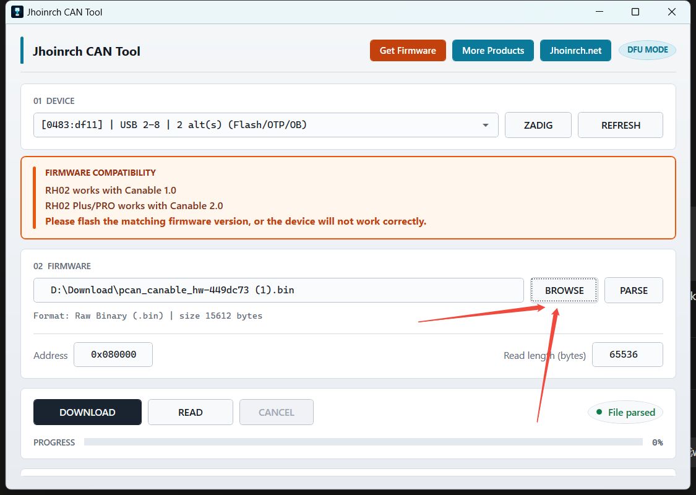
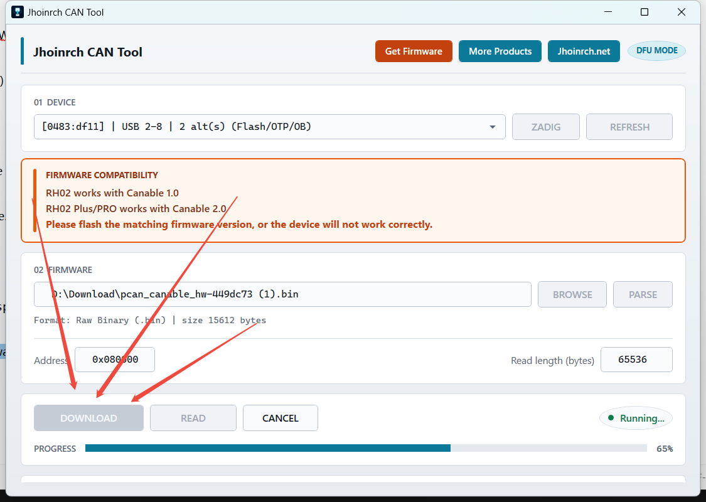

# Usage Guide

Step-by-step usage of **Jhoinrch CAN UPdate Tool**.

---

## 1. Enter DFU mode

Put the device into DFU mode (usually hold **BOOT0** while powering on).

---

## 2. Install WinUSB driver (if needed)

If the device is not detected, click **ZADIG**, pick `DFU in FS Mode` → **WinUSB** → **Replace Driver**.

---

## 3. Refresh and select device

Click **Refresh** to enumerate DFU devices, then select the target device in the list.

---

## 4. Select and parse firmware

Click **Browse** to choose a `.dfu` or `.bin` file, then click **Parse** to inspect format, address, size, VID:PID, and CRC.

---

## 5. Set address (for `.bin` only)

For `.bin` files, fill in the flash address (default `0x08000000`).  
`.dfu` files already contain the address, so this box is disabled.

---

## 6. Flash or Read

- **Flash** — download firmware to the device, then it reboots into the new firmware
- **Read** — export firmware from the device to a `.bin` file
- **Cancel** — stop the running operation

Watch the progress bar and the log panel at the bottom.

---

## Tips

- If enumeration fails, re-check BOOT0 and the WinUSB driver.
- Prefer `.dfu` when available — it carries address and CRC info.
- Keep the USB cable stable during flash; do not unplug mid-write.
